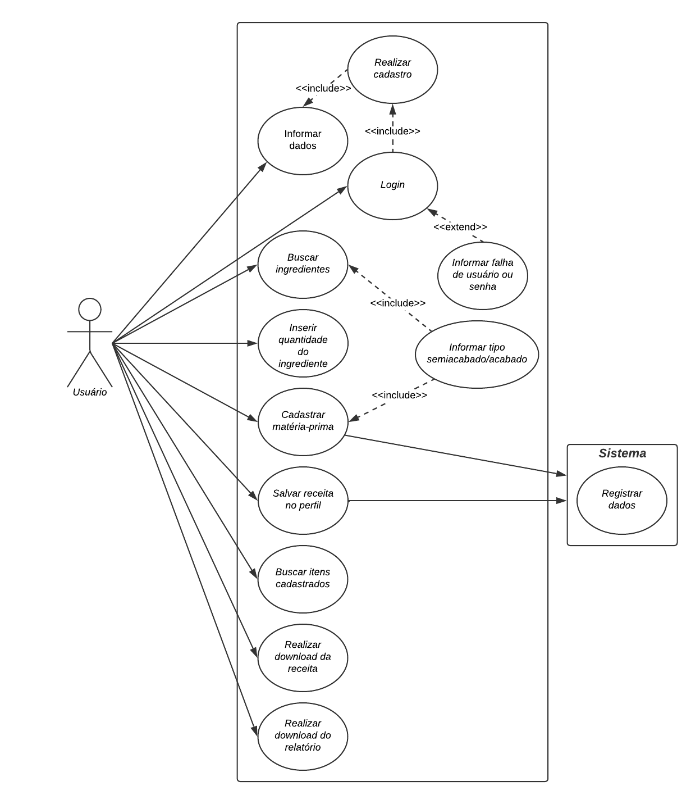

# Especificações do Projeto

Pré-requisitos: [Documentação de Contexto](https://github.com/ICEI-PUC-Minas-PMV-ADS/pmv-ads-2024-1-e2-proj-int-t9-pmv-ads-2024-1-e2-proj-tabela-nutri-t9/blob/main/docs/01-Documenta%C3%A7%C3%A3o%20de%20Contexto.md)

Definição do problema e ideia de solução a partir da perspectiva do usuário. É composta pela definição do  diagrama de personas, histórias de usuários, requisitos funcionais e não funcionais além das restrições do projeto.

Apresente uma visão geral do que será abordado nesta parte do documento, enumerando as técnicas e/ou ferramentas utilizadas para realizar a especificações do projeto

## Personas

1. Nutrição Brasil - Fornecedor de Alimentos:
Nutrição Brasil, fornecedora de alimentos para todo o país, busca um sistema que o auxilie na atualização do modelo de tabela nutricional de seus produtos. Sua necessidade é homologar e fornecer essas informações tendo compliance ao padrão exigido pela Anvisa nos rótulos, garantindo a conformidade e transparência para os consumidores.

2. Maria Saborosa - Comerciante de Comidas Caseiras:
Maria é uma comerciante de comidas caseiras que procura uma ferramenta que lhe permita encontrar rapidamente as informações nutricionais de diferentes marcas. Sua intenção é criar e consultar esses dados para informar seus clientes sobre calorias e nutrientes de seus preparos de forma mais fácil e precisa, fortalecendo a confiança e transparência em sua relação com eles.

3. João Delícias - Comerciante de Comidas Caseiras:
João, também comerciante de comidas caseiras, deseja acessar as informações nutricionais que ele mesmo criou anteriormente para seus produtos. Ele busca manter um histórico dos registros para ser capaz, sempre que necessário, de enviar esses dados aos clientes e gerar novamente o rótulo de receitas antigas. Desta forma, poderá prestar um serviço personalizado ao seus clientes sem perder tempo tendo de dar entrada nos registros mais de uma vez.

4. Dra. Ana Nutrição - Nutricionista:
A Dra. Ana, uma nutricionista que procura uma solução que simplifique o processo de cálculo nutricional de alimentos. Sua meta é otimizar o tempo gasto em tarefas repetitivas, permitindo que ela se concentre mais na elaboração de dietas personalizadas e ofereça um serviço mais eficiente e de qualidade aos seus clientes. Para isso necessita de um sistema que automatize o cálculo de tabelas nutricionais.

5. Dr. Pedro Nutrição - Nutricionista:
O Dr. Pedro, nutricionista de uma grande empresa, tem o objetivo de ranquear a lista de ingredientes para informar os clientes sobre a quantidade relativa nos produtos alimentícios de sua empresa. Ele pretende criar uma lista de nutrientes alergênicos e alertar os clientes, contribuindo para uma orientação mais detalhada e segura sobre os alimentos consumidos. Seria de grande ajuda ao dr. Pedro um sistema que ranqueie os ingredientes de acordo com suas quantidades e também permita classificar produtos alergênicos de acordo com seu ingredientes.

<!--Enumere e detalhe as personas da sua solução. Para tanto, baseie-se tanto nos documentos disponibilizados na disciplina e/ou nos seguintes links:

> **Links Úteis**:
> - [Rock Content](https://rockcontent.com/blog/personas/)
> - [Hotmart](https://blog.hotmart.com/pt-br/como-criar-persona-negocio/)
> - [O que é persona?](https://resultadosdigitais.com.br/blog/persona-o-que-e/)
> - [Persona x Público-alvo](https://flammo.com.br/blog/persona-e-publico-alvo-qual-a-diferenca/)
> - [Mapa de Empatia](https://resultadosdigitais.com.br/blog/mapa-da-empatia/)
> - [Mapa de Stalkeholders](https://www.racecomunicacao.com.br/blog/como-fazer-o-mapeamento-de-stakeholders/)
>
Lembre-se que você deve ser enumerar e descrever precisamente e personalizada todos os clientes ideais que sua solução almeja.-->

## Histórias de Usuários

Com base na análise das personas forma identificadas as seguintes histórias de usuários:

|EU COMO... `PERSONA`| QUERO/PRECISO ... `FUNCIONALIDADE` |PARA ... `MOTIVO/VALOR`                 |
|--------------------|-----------------------|----------------------|
| Fornecedor de alimentos | Ter o modelo de tabela nutricional atualizado em uma aplicação   | Homologar e fornecer a tabela nutricional no padrão exigido pela Anvisa nos rótulos de seus produtos     |
| Comerciante de comidas caseiras  | Encontrar as informações nutricionais de diferentes marcas       | Consultar e criar a informação nutricional de seus preparos, informar aos seus clientes acerca de calorias e nutrientes e rotular os produtos  |
| Comerciante de comidas caseiras | Consultar as informações nutricionais que eu criei anteriormente para os meus produtos | Ter o histórico e enviar para os meus clientes quando necessário |
| Nutricionista | Ter o resultado do cálculo nutricional de alimentos    | Facilitar o processo de calcular e organizar tabelas nutricionais para gastar menos tempo em tarefas repetitivas   |
| Nutricionista | Ranquear a lista de ingredientes para classificar qual está em maior e menor quantidade no produto | Criar uma lista de nutrientes que podem ser alergênicos e alertar os clientes  |

<!-- >> **Links Úteis**:
> - [Histórias de usuários com exemplos e template](https://www.atlassian.com/br/agile/project-management/user-stories)
> - [Como escrever boas histórias de usuário (User Stories)](https://medium.com/vertice/como-escrever-boas-users-stories-hist%C3%B3rias-de-usu%C3%A1rios-b29c75043fac)
> - [User Stories: requisitos que humanos entendem](https://www.luiztools.com.br/post/user-stories-descricao-de-requisitos-que-humanos-entendem/)
> - [Histórias de Usuários: mais exemplos](https://www.reqview.com/doc/user-stories-example.html)
> - [9 Common User Story Mistakes](https://airfocus.com/blog/user-story-mistakes/) -->

## Requisitos

As tabelas que se seguem apresentam os requisitos funcionais e não funcionais que detalham o escopo do projeto.

### Requisitos Funcionais

|ID    | Descrição do Requisito  | Prioridade |
|------|-----------------------------------------|----| 
|RF-001| A aplicação deve permitir a pesquisa e seleção de ingredientes   | ALTA |
|RF-002| A aplicação deve possuir um design modelo padrão de tabela nutricional atualizado   | ALTA |
|RF-003| A aplicação deve classificar e escrever os ingredientes selecionados de acordo com a quantidade do maior para o menor em uma lista   | ALTA |
|RF-004| A aplicação deve permitir a escolha da quantidade de ingredientes para escrever na tabela nutricional  | ALTA |
|RF-005| A aplicação deve salvar a tabela no perfil do usuário que a construiu   | ALTA |
|RF-006| A aplicação deve permitir a consulta das tabelas salvas pelo usuário no perfil   | ALTA |
|RF-007| A aplicação deve permitir baixar em PDF a tabela que o usuário construiu   | ALTA |
|RF-008| A aplicação deve permitir baixar em PDF o relatório com as tabelas já criadas pelo usuário   | ALTA |
|RF-009| A aplicação deve permitir fazer o cadastro do usuário, e o tornar obrigatório para acessar as funcionalidades   | ALTA |
|RF-010| A aplicação deve permitir fazer o login do usuário, e o tornar obrigatório para acessar as funcionalidades   | ALTA |
|RF-011| A aplicação deve permitir a troca de senha do usuário   | MÉDIA |
|RF-012| A aplicação deve permitir a exclusão de conta do usuário   | BAIXA |

### Requisitos não Funcionais

|ID     | Descrição do Requisito  |Prioridade |
|-------|-------------------------|----|
|RNF-001| A aplicação deve ser responsiva para diferentes dispositivos, como desktops, tablets e smartphones | ALTA | 
|RNF-002| A aplicação deve ter uma implementação de autenticação robusta para a proteção de contas |  BAIXA | 
|RNF-003| O sistema deve funcionar nas versões recentes dos principais navegadores (Chrome, Firefox, Edge, Safari) |  ALTA | 
|RNF-004| A aplicação deve ser intuitiva e ter um designer agradável | ALTA | 

## Restrições

O projeto está restrito pelos itens apresentados na tabela a seguir.

|ID| Restrição                                             |
|--|-------------------------------------------------------|
|01| O projeto deverá ser entregue até o final do semestre |
|02| O sistema deve ter um módulo de backend        |
|03| A equipe não pode subcontratar o desenvolvimento do trabalho  |
|04| Todos os membros do grupo devem ser responsáveis por cada parte do Trabalho  |
|05| O sistema deve fornecer um relatório        |
|06| O sistema deve ser implantando em nuvem Azure | 

<!-- Enumere as restrições à sua solução. Lembre-se de que as restrições geralmente limitam a solução candidata.

> **Links Úteis**:
> - [O que são Requisitos Funcionais e Requisitos Não Funcionais?](https://codificar.com.br/requisitos-funcionais-nao-funcionais/)
> - [O que são requisitos funcionais e requisitos não funcionais?](https://analisederequisitos.com.br/requisitos-funcionais-e-requisitos-nao-funcionais-o-que-sao/)
-->
## Diagrama de Casos de Uso

O diagrama de casos de uso é o próximo passo após a elicitação de requisitos, que utiliza um modelo gráfico e uma tabela com as descrições sucintas dos casos de uso e dos atores. Ele contempla a fronteira do sistema e o detalhamento dos requisitos funcionais com a indicação dos atores, casos de uso e seus relacionamentos.

        

