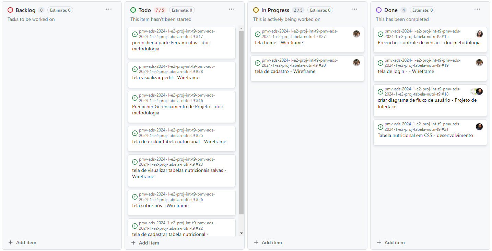

# Metodologia

Pré-requisitos: <a href="2-Especificação do Projeto.md"> Documentação de Especificação</a>

O desenvolvimento deste projeto segue a metodologia ágil SCRUM e utiliza as seguintes ferramentas de apoio ao gerenciamento de tarefas, desenvolvimento e design:

- **Gerenciamento de Tarefas:** GitHub
- **IDE de Desenvolvimento:** Visual Code
- **Design de Interface:** Figma

A equipe se comprometeu com os rituais do Scrum, incluindo uma planning de 1 hora às segundas, e duas dailies de 15 minutos às quartas e sextas. Essas reuniões são coordenadas pela Scrum Master. Os ciclos semanais estão alinhados com a conclusão de cada sprint, que é representada como um milestone e possui suas respectivas tarefas registradas como issues no GitHub.

Além disso, a entrada de novas tarefas no backlog da equipe é principalmente guiada pelas demandas do Product Owner, sendo realizadas pelos membros da equipe responsáveis pelo desenvolvimento e design.

## Controle de Versão

A ferramenta de controle de versão adotada no projeto foi o
[Git](https://git-scm.com/), sendo que o [Github](https://github.com)
foi utilizado para hospedagem do repositório.

O projeto segue a seguinte convenção para o nome de branches:

- `main`: versão estável já testada do software
- `unstable`: versão já testada do software, porém instável
- `testing`: versão em testes do software
- `dev`: versão de desenvolvimento do software

Quanto à gerência de issues, o projeto adota a seguinte convenção para
etiquetas:

- `documentation`: melhorias ou acréscimos à documentação
- `bug`: uma funcionalidade encontra-se com problemas
- `enhancement`: uma funcionalidade precisa ser melhorada
- `feature`: uma nova funcionalidade precisa ser introduzida

Discuta como a configuração do projeto foi feita na ferramenta de versionamento escolhida. Exponha como a gerência de tags, merges, commits e branchs é realizada. Discuta como a gerência de issues foi realizada.

> **Links Úteis**:
> - [Tutorial GitHub](https://guides.github.com/activities/hello-world/)
> - [Git e Github](https://www.youtube.com/playlist?list=PLHz_AreHm4dm7ZULPAmadvNhH6vk9oNZA)
>  - [Comparando fluxos de trabalho](https://www.atlassian.com/br/git/tutorials/comparing-workflows)
> - [Understanding the GitHub flow](https://guides.github.com/introduction/flow/)
> - [The gitflow workflow - in less than 5 mins](https://www.youtube.com/watch?v=1SXpE08hvGs)

## Gerenciamento de Projeto

A escolha da metodologia ágil SCRUM para este projeto é respaldada pelos benefícios citados por Amaral, Fleury e Isoni (2019, p. 68), que incluem:

- Visão clara dos resultados a entregar.
- Ritmo e disciplina necessários à execução.
- Definição de papéis e responsabilidades (Scrum Owner, Scrum Master e Team).
- Empoderamento dos membros da equipe.
- Conhecimento distribuído e compartilhado de forma colaborativa.
- Ambiente favorável para críticas construtivas.

### Divisão de Papéis

A equipe é composta pelos seguintes membros:

- **Scrum Master:** Julia Berto Rosa
- **Product Owner:** Helbert Miranda Benício
- **Equipe de Desenvolvimento:** 
  - Aldrin Taylor C. Bittencourt 
  - Cesar Augusto L. dos Santos
  - Helbert Miranda Benício
  - Jefferson Wagner S. Silva
  - Júlia Berto Rosa
  - Luan César S. dos Santos
- **Equipe de Design:** 
  - Aldrin Taylor C. Bittencourt
  - Helbert Miranda Benício
  - Jefferson Wagner S. Silva

### Processo

Para organização e distribuição das tarefas do projeto, a equipe está utilizando o GitHub, estruturado com as seguintes listas:
- **Backlog:** recebe as tarefas a serem trabalhadas e representa o Backlog do produto. Todas as atividades identificadas no decorrer do projeto são incorporadas a esta lista;
- **To Do:** representa as tarefas retiradas do Backlog de trabalho iminente, isto é, tudo o que está para ser trabalhado em breve;
- **In progress:** contém as tarefas iniciadas;
- **Done:** inclui as tarefas finalizadas e as que passaram pelos testes e controle de qualidade, prontas para serem entregues aos usuários.
O quadro kanban do grupo no GitHub está disponível no link https://github.com/orgs/ICEI-PUC-Minas-PMV-ADS/projects/931/views/1 e é apresentado, no estado atual, na figura abaixo:

### Ferramentas

As ferramentas empregadas no projeto são:

- Editor de código.
- Ferramentas de comunicação
- Ferramentas de desenho de tela (_wireframing_)

O editor de código foi escolhido porque ele possui uma integração com o
sistema de versão. As ferramentas de comunicação utilizadas possuem
integração semelhante e por isso foram selecionadas. Por fim, para criar
diagramas utilizamos essa ferramenta por melhor captar as
necessidades da nossa solução.

Liste quais ferramentas foram empregadas no desenvolvimento do projeto, justificando a escolha delas, sempre que possível.
 
> **Possíveis Ferramentas que auxiliarão no gerenciamento**: 
> - [Slack](https://slack.com/)
> - [Github](https://github.com/)
