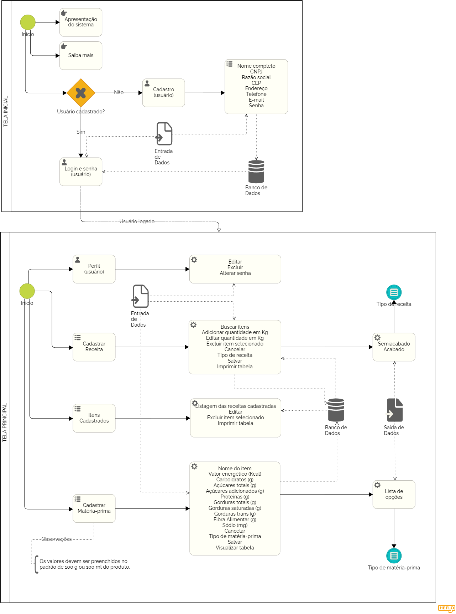

# Projeto de Interface

Pré-requisitos: [Documentação de Especificação](https://github.com/ICEI-PUC-Minas-PMV-ADS/pmv-ads-2024-1-e2-proj-int-t9-pmv-ads-2024-1-e2-proj-tabela-nutri-t9/blob/main/docs/02-Especifica%C3%A7%C3%A3o%20do%20Projeto.md)

Visão geral da interação do usuário pelas telas do sistema e protótipo interativo das telas com as funcionalidades que fazem parte do sistema (wireframes).

 Apresente as principais interfaces da plataforma. Discuta como ela foi elaborada de forma a atender os requisitos funcionais, não funcionais e histórias de usuário abordados nas <a href="2-Especificação do Projeto.md"> Documentação de Especificação</a>.

## Diagrama de Fluxo

O fluxograma representa visualmente o fluxo do sistema, mostrando as etapas, decisões, operações e atividades envolvidas, bem como a sequência de eventos e a interação entre eles.

## Wireframes

São protótipos usados em design de interface para sugerir a estrutura de um site web e seu relacionamentos entre suas páginas. Um wireframe web é uma ilustração semelhante do layout de elementos fundamentais na interface.
 
> **Links Úteis**:
> - [Protótipos vs Wireframes](https://www.nngroup.com/videos/prototypes-vs-wireframes-ux-projects/)
> - [Ferramentas de Wireframes](https://rockcontent.com/blog/wireframes/)
> - [MarvelApp](https://marvelapp.com/developers/documentation/tutorials/)
> - [Figma](https://www.figma.com/)
> - [Adobe XD](https://www.adobe.com/br/products/xd.html#scroll)
> - [Axure](https://www.axure.com/edu) (Licença Educacional)
> - [InvisionApp](https://www.invisionapp.com/) (Licença Educacional)
