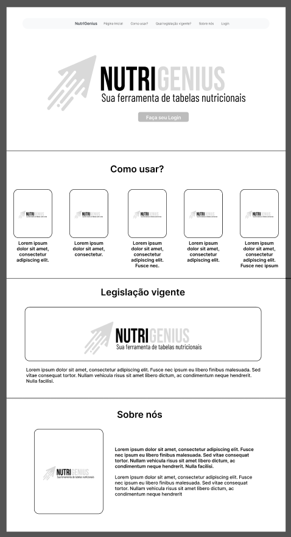
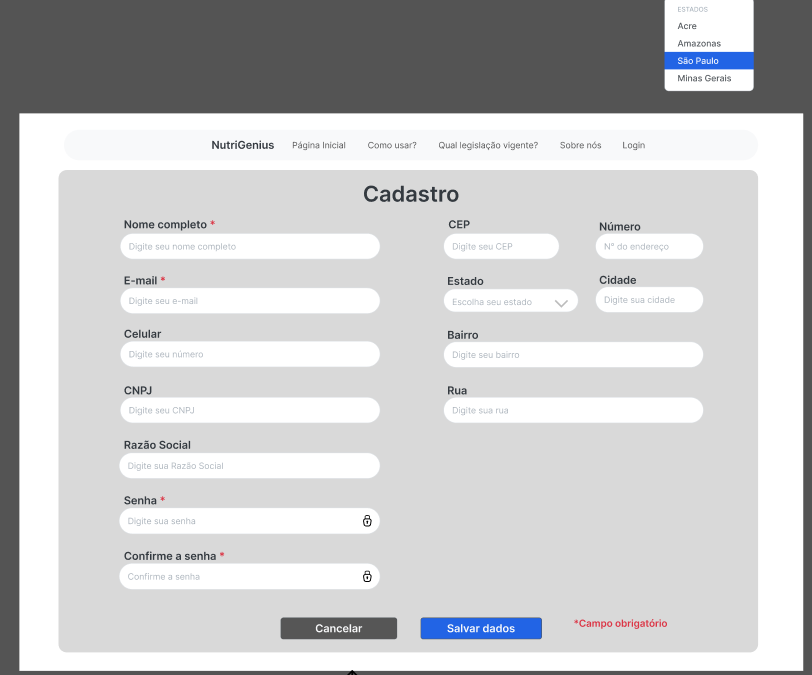

# Projeto de Interface

Pré-requisitos: [Documentação de Especificação](https://github.com/ICEI-PUC-Minas-PMV-ADS/pmv-ads-2024-1-e2-proj-int-t9-pmv-ads-2024-1-e2-proj-tabela-nutri-t9/blob/main/docs/02-Especifica%C3%A7%C3%A3o%20do%20Projeto.md)

Visão geral da interação do usuário pelas telas do sistema e protótipo interativo das telas com as funcionalidades que fazem parte do sistema (wireframes).

 Apresente as principais interfaces da plataforma. Discuta como ela foi elaborada de forma a atender os requisitos funcionais, não funcionais e histórias de usuário abordados nas <a href="2-Especificação do Projeto.md"> Documentação de Especificação</a>.

## Diagrama de Fluxo

O fluxograma representa visualmente o fluxo do sistema, mostrando as etapas, decisões, operações e atividades envolvidas, bem como a sequência de eventos e a interação entre eles.

## Wireframes

**1-** Página Inicial: 

 - Nesta inicial o usuário encontrará as principais informacões sobre a aplicação.

**2-** Tela de Login

- Nesta de tela, o usuário realizará o Login na aplicação.

**3-** Tela de Cadastro

- Nesta de tela, o usuário realizará o cadastro na aplicação.

São protótipos usados em design de interface para sugerir a estrutura de um site web e seu relacionamentos entre suas páginas. Um wireframe web é uma ilustração semelhante do layout de elementos fundamentais na interface.
 
> **Links Úteis**:

> - [Figma - Interativo da aplicação](https://www.figma.com/proto/zPrKn1rMJLkmpdlpKbcpF7/NutriGenius?page-id=0%3A1&type=design&node-id=424-3600&viewport=-6335%2C-427%2C0.59&t=Vr2aVoSsXfygq1TX-1&scaling=min-zoom&mode=design])

